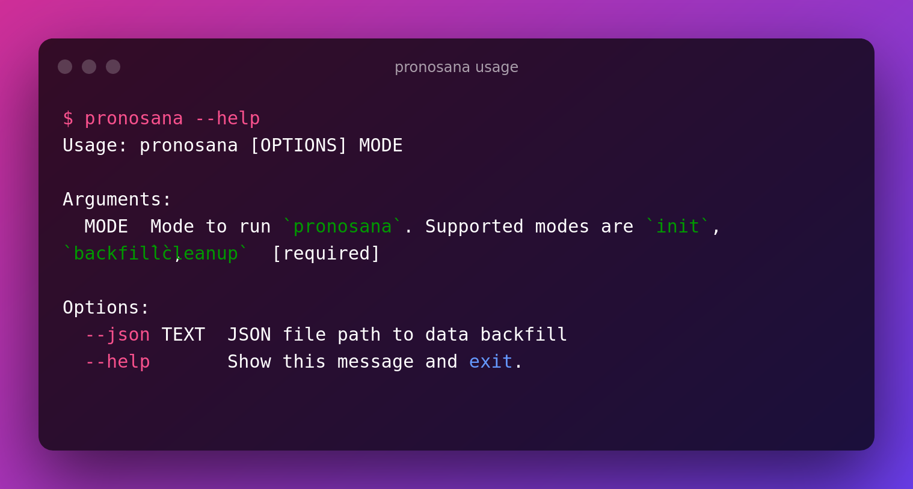

### Pronosana

#### Usage

```
$ pronosana --help
Usage: pronosana [OPTIONS] MODE

Arguments:
  MODE  Mode to run `pronosana`. Supported modes are `init`, `backfill`,
        `cleanup`  [required]

Options:
  --json TEXT  JSON file path to data backfill
  --help       Show this message and exit.

```



##### Initiate

```
$ pronosana init
```

##### Backfill
```
$ pronosana backfill --json <json data>
```

##### cleanup
```
$ pronosana cleanup
```